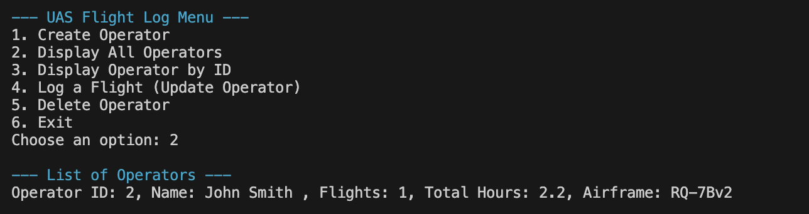
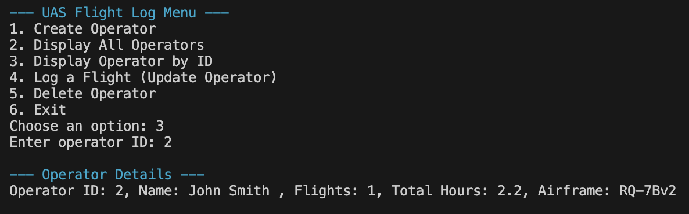
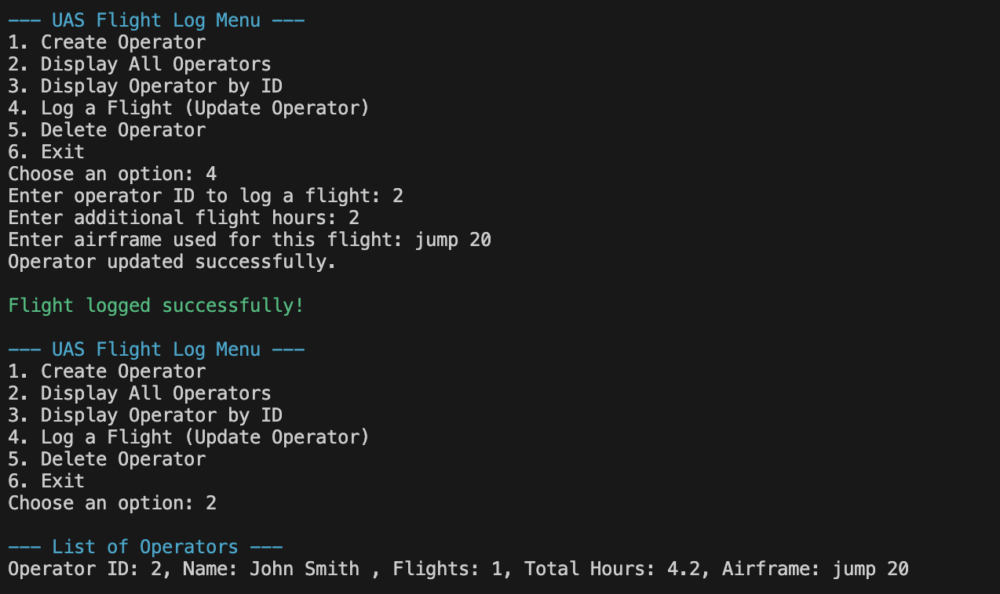
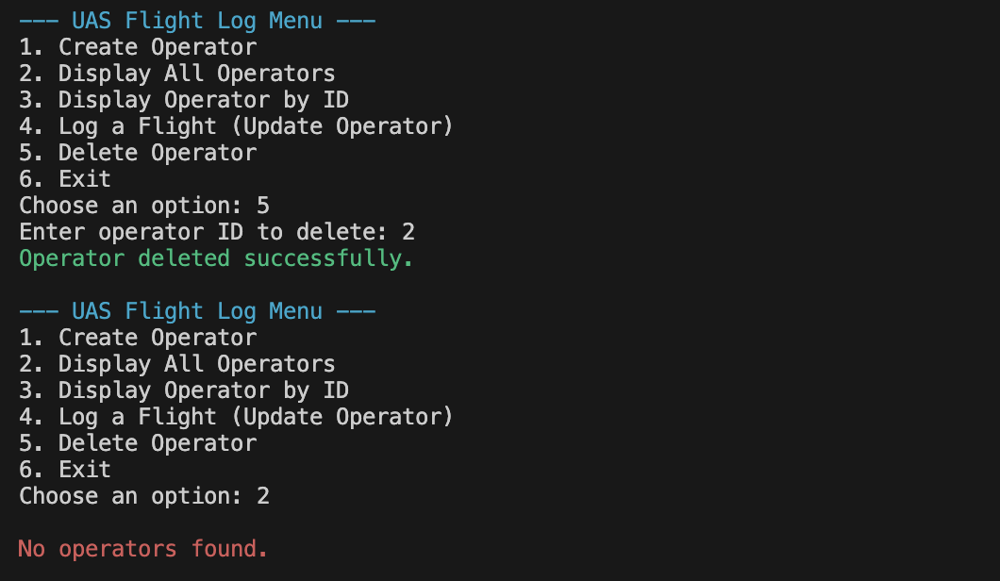

# Uncrewed Aircraft Systems Flight Log

UAS Flight log is a command line project that takes can create an operator profile with number of flights, hours, and airframe/aircraft this `Uncrewed Aircraft System Operator/Pilot` is quaifiled on.

## Create Operator

## Display All Operators in the database

## Display Operator by ID

## Update Operator Log

## Delete Operator 

