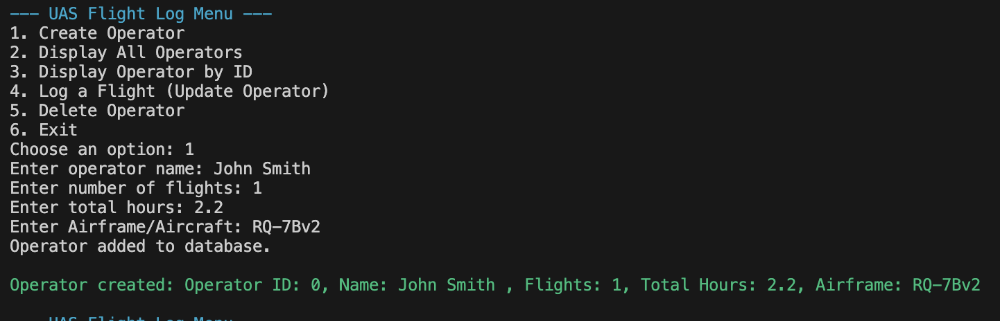

# Uncrewed Aircraft Systems Flight Log

UAS Flight log is a command line project that takes can create an operator profile with number of flights, hours, and airframe/aircraft this `Uncrewed Aircraft System operator/pilot` is quaifiled on.

